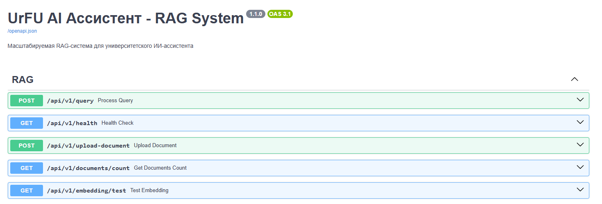
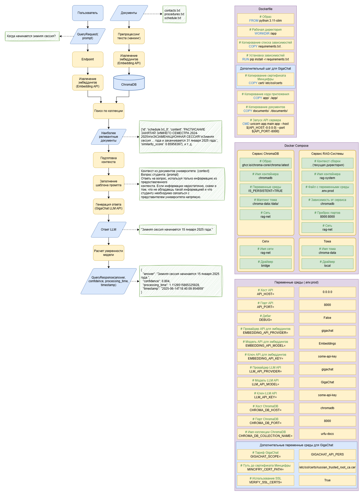

# Тестовое задание Middle ML-Ops инженер
## Этап 1: RAG-система

RAG-система для демонстрации развернута на https://rag.duuuuuuuden.ru/docs, для предотвращения несанкционированного доступа эндпоинты защищены паролем, данные для использования были высланы вместе с репозиторием.

Хранящиеся в RAG-системе документы находятся в папке `documents`.

### 1. Dockerfile для обработки университетских документов

Разработан Dockerfile для сборки REST API, которое автоматически обрабатывает документы, находящиеся в папке documents (реализована обработка только txt файлов, так как это PoC).

### 2. Векторная БД (Chroma/Faiss) с тестовыми данными

Разработан docker-compose.yaml, который запускает два сервиса: rag-system и chromadb, где rag-system это REST API, а chromadb это векторая база данных ChromaDB, которую сервис rag-system автоматически заполняет тестовыми данными при запуске (из папки documents).

### 3. Подключение к GigaChat/YandexGPT через переменные окружения

Разработка PoC RAG-системы велась с учетом использования GigaChat в качестве сервиса для извлечения эмбеддингов и генерации текста. Подлючение происходит через переменные окружения, обозначенные в .env файле. Пример заполнения файла `.env` находится ниже и в файле `.env.example`:

```
API_HOST=0.0.0.0
API_PORT=8000
DEBUG=False

EMBEDDING_API_PROVIDER=gigachat
EMBEDDING_API_MODEL=Embeddings
EMBEDDING_API_KEY={Здесь вставить Authorization Key от GigaChat}

LLM_API_PROVIDER=gigachat
LLM_API_MODEL=GigaChat
LLM_API_KEY={Здесь вставить Authorization Key от GigaChat}

GIGACHAT_SCOPE=GIGACHAT_API_PERS
MINCIFRY_CERT_PATH=/etc/ssl/certs/russian_trusted_root_ca.cer
VERIFY_SSL_CERTS=True

CHROMA_DB_HOST=chromadb
CHROMA_DB_PORT=8000
CHROMA_DB_COLLECTION_NAME=urfu-docs
```

Реализовано подключение сертификата Минцифры для обеспечения безопасного соединения.

### 4. Endpoint для вопросов типа "Когда сессия?"

Реализованы 5 эндпоинтов, которые позволяют задать вопрос, проверить работоспособность сервисов, загрузить документ в RAG-систему, вывести количество документов (чанков) в системе, а также проверить извлечение эмбеддингов.



Схема работы RAG-системы, устройство Dockerfile и docker-compose представлены ниже:


