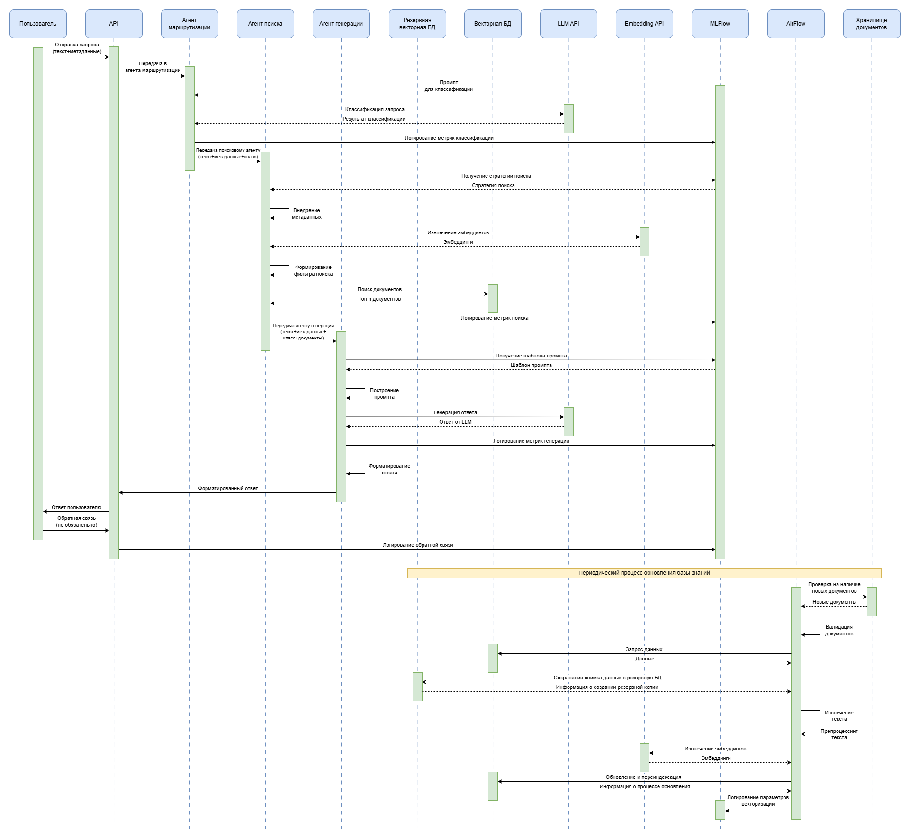

# Тестовое задание Middle ML-Ops инженер
## Этап 2: Мультиагентная архитектура

### 1. Агент для маршрутизации запросов (учебные/административные)

Предложены два варианта классификации запросов: использование LLM и использование ML моделей для бинарной классификации. Проанализированы плюсы и минусы каждого подхода. Дальнейшие агенты и протокол взаимодействия проектировались с учетом использования LLM для классификации.

### 2. Агент для поиска по базе знаний

Агент для поиска по базе знаний спроектирован с учетом класса запроса, а также с учетом метаданных пользователя, по которым производится фильтрация в коллекции векторного хранилища перед поиском документов. Например, если запрос административный и исходит от преподавателя - совершать фильтрацию по этим метаданным, а после производить поиск релевантных документов. Также учтено A/B тестирование стратегий поиска.

### 3. Агент для генерации персонализированных ответов

Агент для генерации персонализированных ответов спроектирован с учетом хранения промптов в MLFlow Model Registry, которые выбираются в зависимости от класса вопроса и метаданных пользователя. Учтено, что системой смогут пользоваться студенты из дальнего зарубежья, для чего предусмотрено наличие промптов на английском языке. Также учтено логирование и трекинг параметров в MLFlow и возможость пользователя отправить обратную связь об ответе системы, что также логируется в MLFlow.

### 4. Протокол взаимодействия

Протокол взаимодействия спроектирован с учетом наличия AirFlow и MLFlow, внешнего хранилища документов, а также резервной векторной базы данных на случай повреждения основной, в которую сохраняется снимок данных перед запуском DAG для обновления базы знаний.

