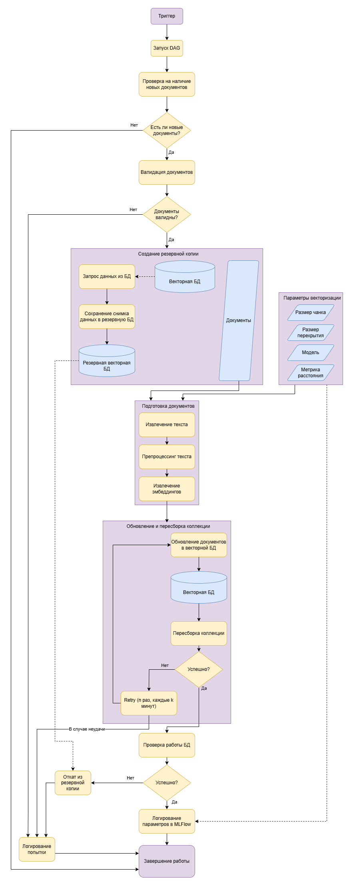

# Тестовое задание Middle ML-Ops инженер
## Этап 3: AirFlow Pipeline

### 1. DAG обновления базы знаний

Спроектирован DAG для обновления базы знаний, который будет запускаться в определенное время (например, раз в сутки), проверять наличие новых документов, производить их валидацию, сохранять снимок текущего состояния БД в резервную базу, извлекать текст, подготавливать его и добавлять в базу знаний. В случае отказа БД после обновления - производить откат до предыдущей версии.

### 2. Переиндексация векторной БД

Проектирование велось с учетом использования ChromaDB в качестве векторного хранилища, которое, в свою очередь, производит индексацию автоматически [(источник)](https://docs.trychroma.com/docs/overview/getting-started#:~:text=indexing%20automatically). Однако, если говорить о [**пересборке коллекции**](https://cookbook.chromadb.dev/strategies/rebuilding/) для оптимизации производительности после большого количества обновлений, то она учтена в проектировании.

### 3. Валидация ответов с retry-логикой

Не совсем было ясно, валидация каких ответов должна происходить, однако, так как этот этап идет сразу после пересборки коллекции, был сделан вывод, что речь идет о статусе процесса обновления базы знаний (вероятно, этот пункт понят мной неправильно...). На этот случай присутствует retry-логика для повторной попытки обновления базы знаний. В случае неудачи происходит логирование попытки, а также завершение работы DAG. При успешном извлечении эмбеддингов из чанков документов производится логирование параметров векторизации в MLFlow.

