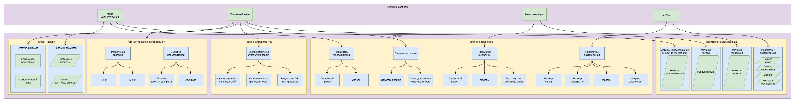

# Тестовое задание Middle ML-Ops инженер
## Этап 4: MLFlow трекинг

1. Логирование параметров векторизации
2. Model Registry для промптов
3. A/B тестирование стратегий поиска

Структура MLFlow отображена ниже (желательно открыть в новой вкладке, т.к. очень большое изображение):

